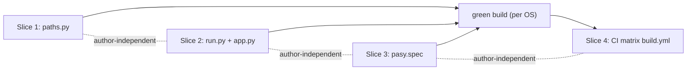

# Shipping Plan — Rostlinolékařské pasy (Windows + macOS portable, PyInstaller onedir)

How to package and ship the plant-passport Flask app as a **portable folder** built with PyInstaller (`onedir`) — a **Windows** folder (`Pasy.exe` + `_internal/`) and a **macOS** folder (unix `Pasy` executable + `_internal/`) — both locally and via one GitHub Actions workflow. This is **rung 2** of the agreed laziness ladder: a single-user, single-process, double-click desktop-style app. No Docker, no WSGI server, no multi-user rewrite, no install-to-site-packages, and — on macOS — **no `.app` bundle, no notarization** unless we ever outgrow one trusted recipient.

The macOS port is deliberately cheap: by choosing a onedir **folder** on macOS (not a `.app`), `sys.executable` lands beside the data exactly like Windows, so `paths.py`, `run.py`, and `pasy.spec` stay **single, cross-platform files** with no `sys.platform` branching. The only real macOS-specific work is one CI matrix leg and the recipient's Gatekeeper-quarantine step.

---

## 0. Slice index (for the orchestrator)

The work is **four independent slices**, all **shared-and-refined** (cross-platform) — there are **zero macOS-only *code* slices by design**: the onedir-folder choice folds macOS entirely into the Windows slices. The only macOS-only *additions* are documentation (§6.2 macOS first-run checklist + §6.3 Gatekeeper), which live in this plan, not in the repo.

Slices 1, 2, 3, 4 can all be **authored fully in parallel** — none imports another's runtime code. The `pasy.spec` **file** authors with no deps but only *builds green* once Slices 1 & 2 land; the CI workflow authors with no deps but only *runs green* once 1+2+3 land. Verification of a built artifact requires 1+2+3 on each target OS.

| # | Slice | Files touched | Kind | Depends on |
|---|-------|---------------|------|------------|
| 1 | Cross-platform frozen `paths.py` | `src/paths.py` | shared-refined (Win+mac) | — |
| 2 | Cross-platform entrypoint + browser open | `run.py` (+ cleanup in `src/app.py`) | shared-refined (Win+mac) | — |
| 3 | Cross-platform `pasy.spec` | `pasy.spec` (new, repo root) | shared-refined (Win+mac) | authoring: none; green build: 1+2 |
| 4 | GitHub Actions matrix build (Win+mac) | `.github/workflows/build.yml` (new) | shared-refined (Win+mac) | green CI: 1+2+3 |

**Fan-out guidance:** assign one agent per slice (4 parallel agents). Each agent edits exactly one primary file and touches no other slice's file, so there are no write collisions. Each slice's acceptance criteria are split into **Dev** (runnable on any OS, incl. the Windows dev box here), **Windows-built** (verify locally on this machine), and **macOS-built** (verify in CI on `macos-latest`, or on a Mac if one is available) — the orchestrator routes the platform-gated checks accordingly.



---

## 1. Overview & decision rationale

**What we ship (per OS):** a folder `Pasy/` containing the launcher (`Pasy.exe` on Windows, unix `Pasy` on macOS) plus a PyInstaller `_internal/` runtime. The user drops their own `data/sarze.xlsx` and `credentials.json` next to the launcher, launches it, a console/Terminal window shows the server log, and the default browser opens `http://localhost:5001`.

**Why `onedir` (not `onefile`) — both OSes:**
- Faster startup — no per-launch extraction of the whole app to a temp `_MEIPASS`.
- Keeps the writable-data story clean: user data lives **next to the launcher**, physically separate from the read-only bundle. `onefile` re-extracts to a throwaway temp dir each run, which fights the "data sits beside the launcher" model.

**Why portable (data next to the launcher, no `%APPDATA%` / `~/Library`, no platformdirs):**
- Matches the app's existing single-source-of-truth design: `src/paths.py` derives everything from one `ROOT`. We only redefine `ROOT` when frozen, and — crucially — the frozen definition is **the same expression on both OSes** (see §1.1).
- Single-user intent is already baked in (global `matcher`, `session`, dev server). A portable folder is the least-ceremony delivery on either platform.

### 1.1 The macOS data-location decision (the critical one) → onedir FOLDER

Under a PyInstaller macOS **`.app` bundle**, `sys.executable` = `Pasy.app/Contents/MacOS/Pasy`, so `Path(sys.executable).parent` points **inside** the bundle — the read-only app package. That would break the "data sits next to the launcher" model and try to write into a bundle that must stay read-only. We evaluated three options:

| Option | `ROOT` when frozen | `paths.py` cost | Verdict |
|--------|--------------------|-----------------|---------|
| **(a) macOS onedir FOLDER** (unix `Pasy` exe in a folder) | `Path(sys.executable).resolve().parent` = the folder | **none** — identical to the Windows line | ✅ **Chosen** |
| (b) `.app` bundle, data beside the `.app` | `Path(sys.executable).resolve().parents[2]` (walk up `Contents/MacOS`) | platform branch + fragile: data lands next to the `.app`, unwritable once dragged to `/Applications` | ❌ |
| (c) `~/Library/Application Support/Pasy` | a mkdir'd per-user dir | platform branch + mkdir + diverges from the "drop data beside it" model | ❌ |

**Decision: (a) macOS onedir folder.** A onedir build **without `BUNDLE`** produces a plain POSIX folder whose launcher is a unix executable (`dist/Pasy/Pasy`). There, `sys.executable` is that unix exe and `Path(sys.executable).resolve().parent` is the folder root — **byte-for-byte the same semantics as Windows**. So `paths.py` gets **one cross-platform frozen branch, unchanged from the Windows expression**; only the comment gains macOS context. This is the ponytail win: the data-location problem only exists if you pick `.app`; choosing the folder dissolves it, keeps ONE `paths.py`, and keeps the recipient's mental model identical across OSes ("keep the folder together; drop `data/` beside the launcher").

**Ruled out on macOS (and why):**
- **`.app` + `BUNDLE`** — needs a `paths.py` platform branch (`parents[2]`), writes user data next to the `.app` (unwritable if moved to `/Applications`), hides the console banner (no Terminal window → recipient can't see the server log or a traceback), and adds `BUNDLE`/`Info.plist` spec surface. Rejected; see §7.6 and §7.12 for why the folder wins.
- **`~/Library/Application Support`** — native, but extra indirection/mkdir the app never needed, and it splits the cross-platform mental model. YAGNI.
- **`universal2`** — demands universal2 wheels for every binary dep (reportlab `_rl_accel`, Pillow, …); a single arch-specific wheel fails the build. Fragile; not lazy. Upgrade path only (§7.4).
- **Notarization / Developer-ID signing** — needs a paid Apple Developer account; overkill for one trusted recipient. Upgrade path only (§6.3).

**What was ruled out (both OSes, unchanged):**
- Docker / WSGI (gunicorn/waitress) / reverse proxy — rung 3+, unnecessary for one desktop user on localhost.
- `%APPDATA%` / `~/Library` + platformdirs — extra dependency and indirection the app never needed.
- `onefile` — slower start, temp re-extraction, muddies writable data.
- pip install / PyPI packaging — recipient has no Python; the whole point of PyInstaller is to avoid that.

**Runtime dependency budget:** unchanged, both OSes. PyInstaller is build-time only. The only stdlib additions in app code are `webbrowser`, `threading` (already imported in `src/app.py`), and `sys.frozen` checks — all cross-platform.

---

## 2. Portable folder layout (what the recipient gets)

### 2.1 Windows — after extracting `Pasy-windows.zip`

```
Pasy/                        <- the portable folder; keep everything together
|- Pasy.exe                  <- double-click to launch
|- _internal/                <- PyInstaller runtime; DO NOT TOUCH / DO NOT MOVE files out
|  |- python3xx.dll
|  |- base_library.zip
|  |- templates/index.html            (bundled Flask template)
|  |- static/app.js, static/style.css (bundled Flask static)
|  |- assets/eu_flag.png              (bundled; see ponytail note 7.7)
|  |- assets/DejaVuSans*.ttf         (vendored Czech font, regular+bold)
|  \- ... (deps: flask, pdfplumber, reportlab, google libs, ...)
|
|- data/                     <- YOU create this folder
|  \- sarze.xlsx             <- YOU drop the batch catalogue here (REQUIRED at startup)
|- credentials.json          <- YOU drop the Google OAuth client here (needed for Drive upload)
|- token.json                <- auto-written after first OAuth consent
|- drive_config.json         <- optional; managed by the app
\- výstupy/                   <- auto-created; generated PDFs land here
```

### 2.2 macOS — after extracting `Pasy-macos.zip`

```
Pasy/                        <- the portable folder; keep everything together
|- Pasy                      <- unix executable; double-click in Finder (opens Terminal) or `./Pasy`
|- _internal/                <- PyInstaller runtime; DO NOT TOUCH / DO NOT MOVE files out
|  |- Python                          (embedded interpreter dylib)
|  |- base_library.zip
|  |- templates/index.html            (bundled Flask template)
|  |- static/app.js, static/style.css (bundled Flask static)
|  |- assets/eu_flag.png              (bundled; see ponytail note 7.7)
|  |- assets/DejaVuSans*.ttf         (vendored Czech font — renders Czech diacritics)
|  \- ... (deps: flask, pdfplumber, reportlab, google libs, ...)
|
|- data/                     <- YOU create this folder
|  \- sarze.xlsx             <- YOU drop the batch catalogue here (REQUIRED at startup)
|- credentials.json          <- YOU drop the Google OAuth client here (needed for Drive upload)
|- token.json                <- auto-written after first OAuth consent
|- drive_config.json         <- optional; managed by the app
\- výstupy/                   <- auto-created; generated PDFs land here
```

On **both** OSes, user-writable state (`data/`, `výstupy/`, `credentials.json`, `token.json`, `drive_config.json`) sits **beside the launcher** because Slice 1 sets `ROOT = Path(sys.executable).resolve().parent` when frozen — the same expression on both. The `_internal/` bundle is read-only.

> **Keep the folder intact.** Moving the launcher out of its folder breaks it (`_internal/` must stay beside it). Data is resolved relative to the launcher, so the launcher and `data/` must live together.

---

## 3. Implementation slices

### Slice 1 — Cross-platform frozen `src/paths.py`

**File:** `src/paths.py` (edit — only the ROOT computation).

**Kind:** shared-refined (Windows + macOS). The frozen expression is identical on both OSes because we ship a onedir **folder** on macOS (§1.1), not a `.app`.

**Why:** under PyInstaller, `Path(__file__).resolve().parent.parent` points *inside* the bundle (`_internal`), so `data/`, `výstupy/`, `credentials.json` would be looked up in the read-only bundle instead of next to the launcher. `sys.executable` is the launcher path when frozen — `Pasy.exe` on Windows, the unix `Pasy` exe on macOS — and in both cases its parent is the portable folder root. (This is exactly why we avoid a macOS `.app`, where `sys.executable` would instead be `Pasy.app/Contents/MacOS/Pasy` and its parent would be inside the bundle — see §1.1.)

**Exact new file contents (save as UTF-8 — comments contain diacritics):**

```python
"""Centrální umístění souborů projektu.

Jediný modul, který zná adresářovou strukturu. Ostatní moduly importují
pojmenované cesty odtud místo ručního `Path(__file__).parent` — přesun
souborů se pak řeší na jednom místě.
"""
import sys
from pathlib import Path

# Kořen aplikace:
#  - vývoj: o úroveň výš než src/ (kde leží tento soubor).
#  - frozen (PyInstaller onedir): adresář vedle spustitelného souboru.
#      Windows: vedle Pasy.exe.
#      macOS:   vedle unixového spustitelného souboru Pasy VE SLOŽCE.
#    ZÁMĚRNĚ onedir SLOŽKA, ne .app bundle — v .app by sys.executable mířil
#    DOVNITŘ (Pasy.app/Contents/MacOS/Pasy) a psali bychom do read-only bundlu.
#    Díky tomu je frozen větev na obou OS identická a data/, výstupy/,
#    credentials.json leží vedle spustitelného souboru.
# ponytail: jedna cross-platform větev — onedir SLOŽKA dělá
#           Path(sys.executable).parent shodným na Windows i macOS.
#           Viz docs/shipping_plan.md §1.1.
if getattr(sys, 'frozen', False):
    ROOT = Path(sys.executable).resolve().parent
else:
    ROOT = Path(__file__).resolve().parent.parent

DATA_DIR = ROOT / 'data'          # sarze.xlsx (katalog šarží)
ASSETS_DIR = ROOT / 'assets'      # eu_flag.png
OUTPUT_DIR = ROOT / 'výstupy'     # generované výstupy (pasy_{datum})

# Google Drive konfigurace (mimo git, v kořeni aplikace)
CREDENTIALS_PATH = ROOT / 'credentials.json'
TOKEN_PATH = ROOT / 'token.json'
CONFIG_PATH = ROOT / 'drive_config.json'
```

**Diff summary:** add `import sys`; replace the single `ROOT = ...` line with the `if getattr(sys,'frozen',False)` branch. The frozen expression `ROOT = Path(sys.executable).resolve().parent` is the same on both OSes; only the comment is expanded to cover macOS. Everything below `ROOT` is byte-for-byte unchanged.

**Acceptance criteria:**
- **Dev (any OS):** from repo root, `python -c "import sys; sys.path.insert(0,'src'); import paths; print(paths.ROOT, paths.OUTPUT_DIR)"` prints the repo root and `<repo>/výstupy` (Windows: `<repo>\výstupy`). Byte-identical `else` path.
- **Windows-built:** after Slice 3 builds, launching `dist\Pasy\Pasy.exe` and generating output creates `dist\Pasy\výstupy\...` **next to the exe** — NOT under `dist\Pasy\_internal\`.
- **macOS-built (CI or Mac):** launching `dist/Pasy/Pasy` and generating output creates `dist/Pasy/výstupy/...` **next to the unix exe** — NOT under `dist/Pasy/_internal/`. Confirms the frozen branch resolves to the folder, not inside a bundle.
- The frozen branch is selected only when `sys.frozen` is truthy (PyInstaller sets it); the `else` path is byte-identical to today.

---

### Slice 2 — Cross-platform entrypoint + browser auto-open

**Files:** `run.py` (edit — this is the PyInstaller entry script). Plus a one-block cleanup in `src/app.py`.

**Kind:** shared-refined (Windows + macOS). The entrypoint is already fully cross-platform: `webbrowser.open` uses the platform default (`start` on Windows, `open`/`NSWorkspace` on macOS), and `threading.Timer` + `sys.frozen` are platform-agnostic. **No macOS-specific code is added.**

**Why:**
- `debug=True` starts the Werkzeug reloader, which forks a child process — broken/undesirable in a frozen exe on either OS. Must be `debug=False` when frozen (reloader then off, no child, no double browser-open).
- A frozen desktop app should open the browser itself. Use stdlib `webbrowser.open` fired from a `threading.Timer` so it runs *after* the server binds. Guard it behind `frozen` so dev runs (with the reloader) never double-open. On macOS `webbrowser.open` invokes the default browser via `open`; on Windows via the shell association — same one call.
- The browser-open + frozen logic lives in **`run.py`** (the PyInstaller entry), keeping `src/app.py` as a pure app module. `src/app.py`'s trailing `if __name__ == '__main__': app.run(debug=True, port=5001)` block is **dead** under this entry (app is always *imported* as module `app`, never run as `__main__`) and carries a stale `debug=True`; remove it to avoid a second, divergent entrypoint.

**Exact new `run.py` contents (save as UTF-8):**

```python
"""Spouštěč serveru.

    python run.py            # vývoj (debug + reloader)
    Pasy.exe / ./Pasy        # frozen (PyInstaller) — debug off, otevře prohlížeč

Přidá src/ na cestu a spustí Flask aplikaci na portu 5001.
"""
import sys
import threading
import webbrowser
from pathlib import Path

sys.path.insert(0, str(Path(__file__).resolve().parent / 'src'))

from app import app  # noqa: E402

PORT = 5001


def _open_browser() -> None:
    webbrowser.open(f'http://localhost:{PORT}')


if __name__ == '__main__':
    frozen = getattr(sys, 'frozen', False)
    print("\n🌿 Rostlinolékařské pasy — spouštím server...")
    print(f"👉  Otevři prohlížeč na: http://localhost:{PORT}\n")
    if frozen:
        # Prohlížeč otevři až server naběhne. debug=False => žádný reloader,
        # žádný child proces, žádné dvojité otevření. Cross-platform:
        # webbrowser.open použije výchozí prohlížeč (Windows i macOS).
        # ponytail: Timer stačí, poll na port je zbytečný pro lokální server.
        threading.Timer(1.5, _open_browser).start()
    app.run(debug=not frozen, port=PORT)
```

**Cleanup in `src/app.py`:** delete the trailing block (the last 4 lines of the file):

```python
if __name__ == '__main__':
    print("\n🌿 Rostlinolékařské pasy — spouštím server...")
    print("👉  Otevři prohlížeč na: http://localhost:5001\n")
    app.run(debug=True, port=5001)
```

This block never runs in this project (only `run.py` is executed / frozen). Removing it leaves exactly one entrypoint. Do **not** touch anything else in `src/app.py`.

**Acceptance criteria:**
- **Dev (any OS):** `python run.py` still starts the dev server with reloader (`debug=True`) and does **not** auto-open a browser (same manual UX as today).
- **Windows-built:** launching `Pasy.exe` starts the server with `debug=False` (console shows a single server start, no "Restarting with..." reloader line), and the default browser opens `http://localhost:5001` within ~2s. Exactly **one** browser tab opens.
- **macOS-built (CI or Mac):** launching `./Pasy` (or double-clicking `Pasy` in Finder, which opens Terminal) starts the server with `debug=False`; the Terminal shows a single server banner; the default browser opens `http://localhost:5001` within ~2s; exactly one tab.
- `grep` for `app.run(` across the repo returns exactly one call site (`run.py`); the `src/app.py` `__main__` block is gone.

> **Font note (small cross-platform code change):** `_register_fonts()` (`src/pdf_generator.py`) tries `C:\Windows\Fonts\arial.ttf` first, then a **vendored DejaVu** (`assets/DejaVuSans.ttf` + `-Bold.ttf`) found via `sys._MEIPASS` when frozen (bundle `_internal/assets/`) or the repo `assets/` in dev. Windows uses arial; macOS (and any stripped Windows) uses the bundled DejaVu, which fully covers Czech diacritics. reportlab does **not** ship DejaVu — it ships Bitstream Vera, which lacks ě/ř/ů/ť/ň — so we vendor DejaVu rather than rely on `collect_data_files('reportlab')`. See §7.3.

---

### Slice 3 — Cross-platform `pasy.spec` PyInstaller spec

**File:** `pasy.spec` (new, at repo root next to `run.py`).

**Kind:** shared-refined (Windows + macOS). **ONE spec, no `sys.platform` branch, no separate `pasy-macos.spec`, no `BUNDLE`.** PyInstaller already handles the OS differences (the `.exe` suffix on Windows, the unix bootloader on macOS). Every knob in this spec (`datas`, `hiddenimports`, `console`, `target_arch`, `EXE`/`COLLECT`) is platform-agnostic here, so a `sys.platform` branch would be speculative complexity. A separate macOS spec would duplicate the whole file for zero benefit. **Omitting `BUNDLE` is the key macOS decision** — it keeps the output a onedir *folder* (unix exe + `_internal/`), preserving the "data beside the launcher" model and the visible Terminal banner (§1.1, §3-Why below).

**Why each piece:**
- `pathex=['src']` — `run.py` does `from app import app`; the sibling modules (`app`, `pdf_generator`, `drive_uploader`, `paths`, ...) live in `src/`. PyInstaller's static analysis needs `src` on its search path (it does not execute `run.py`'s runtime `sys.path.insert`).
- `datas` for `src/templates` -> `templates` and `src/static` -> `static` — `app = Flask(__name__)` resolves templates/static relative to the frozen `app` module's root (`_internal`); placing them at `templates/`/`static/` under the bundle content dir matches that. Forward-slash paths work on both OSes.
- `datas` for `assets/eu_flag.png` — ships the flag (base64 fallback also exists; see ponytail note 7.7).
- `datas` for `assets/DejaVuSans.ttf` + `assets/DejaVuSans-Bold.ttf` — the **vendored Czech font**, since reportlab ships only Bitstream Vera (missing ě/ř/ů/ť/ň). Lands in `_internal/assets/`; `_register_fonts()` resolves it via `sys._MEIPASS` when frozen. This is the real font source on macOS (and stripped Windows).
- `collect_data_files('reportlab')` — reportlab's own data (AFM metrics, Vera fonts). Kept as a harmless safety net; it is **not** the Czech font source (reportlab has no DejaVu — we vendor our own, above).
- `collect_data_files('googleapiclient')` — bundles the static `discovery_cache/documents/*.json` used by `googleapiclient.discovery.build`.
- `hiddenimports` — the google modules are imported lazily *inside* functions in `drive_uploader.py`; list them explicitly as belt-and-suspenders, plus `pdfminer` (via `pdfplumber`) and `PIL` (image embedding). Same list on both OSes.
- `console=True` — the app IS a CLI-launched local server. **On Windows** it shows a console window with the log. **On macOS**, for a onedir *folder* (no `BUNDLE`), double-clicking the unix `Pasy` in Finder makes Finder open **Terminal.app** and run it there, so the recipient sees the same server banner, the `✓ Šarže načtena` line, and any traceback, and can Ctrl+C to quit. (This visible banner is a second reason to avoid a `.app`, where `console` has no effect and logs would only reach `stderr`/Console.app.)
- `EXE(exclude_binaries=True)` + `COLLECT(name='Pasy')` — the `onedir` shape. Output: `dist/Pasy/Pasy.exe` + `dist/Pasy/_internal/` on Windows; `dist/Pasy/Pasy` (unix exe) + `dist/Pasy/_internal/` on macOS. **No `BUNDLE(...)` call** → no `.app`.
- `target_arch=None` — build for the current architecture. On Windows this is ignored. On `macos-latest` (Apple Silicon) it produces an **arm64** binary. We deliberately do **not** set `'universal2'` (would require universal2 wheels for every binary dep and commonly fails the build) and do not run an Intel matrix leg (doubles CI for a hypothetical Intel recipient). See §7.4 for the upgrade path.
- `argv_emulation=False` — the macOS `.app` file-drop shim; irrelevant for a non-`.app` folder that takes no file arguments. Keep `False`.
- `codesign_identity=None` / `entitlements_file=None` — ship unsigned (PyInstaller still auto ad-hoc-signs on Apple Silicon so the binary *runs*; the only recipient barrier is download quarantine, handled in §6.3). Set a Developer-ID identity here only if you adopt notarization later.
- `upx=False` — no UPX dependency; avoids antivirus false positives.

> Written for **PyInstaller 6.x** (matches local 6.21.0): no `cipher`/`block_cipher`, no `a.zipped_data`/`a.zipfiles`, includes `optimize=0`. Save the file as UTF-8 (comments contain diacritics).

**Exact `pasy.spec` contents (copy-paste verbatim):**

```python
# -*- mode: python ; coding: utf-8 -*-
# pasy.spec — PyInstaller 6.x onedir spec pro Rostlinolékařské pasy (Windows + macOS).
# Build:  pyinstaller pasy.spec
#   Windows -> dist/Pasy/Pasy.exe   (+ dist/Pasy/_internal/)
#   macOS   -> dist/Pasy/Pasy       (unixový spustitelný soubor, + dist/Pasy/_internal/)
# ponytail: JEDEN cross-platform spec — žádná větev na sys.platform, žádný BUNDLE.
#   PyInstaller sám řeší rozdíly OS (přípona .exe, bootloader). BUNDLE bychom
#   přidali jen kdybychom chtěli .app — to ale rozbije 'data vedle spustitelného
#   souboru' model (viz src/paths.py, docs/shipping_plan.md §1.1) a schová konzoli.
#   onedir SLOŽKA => data leží vedle spustitelného souboru na obou OS a
#   console=True ukáže log (Windows konzole / macOS Terminal po dvojkliku).
# target_arch=None => host arch (na macos-latest = arm64 / Apple Silicon).

from PyInstaller.utils.hooks import collect_data_files

datas = [
    ('src/templates', 'templates'),   # Flask hledá šablony vedle app modulu (frozen root = _internal)
    ('src/static', 'static'),
    ('assets/eu_flag.png', 'assets'),  # passport_generator má i base64 zálohu
    ('assets/DejaVuSans.ttf', 'assets'),       # font s českou diakritikou (vendored)
    ('assets/DejaVuSans-Bold.ttf', 'assets'),
]
# DejaVu font (čeština) přibalujeme z assets/ výše — reportlab žádný DejaVu nemá
# (jen Vera bez ě/ř/ů). collect_data_files sebere jen vlastní data reportlabu.
datas += collect_data_files('reportlab')
# googleapiclient statické discovery dokumenty (discovery_cache/documents/*.json)
datas += collect_data_files('googleapiclient')

hiddenimports = [
    'pdfminer',                          # pdfplumber -> pdfminer.six
    'PIL',                               # vkládání obrázků (reportlab/pdfplumber)
    'google.auth.transport.requests',    # lazy importy v drive_uploader.py
    'google.oauth2.credentials',
    'google_auth_oauthlib.flow',
    'googleapiclient.discovery',
    'googleapiclient.http',
]

a = Analysis(
    ['run.py'],
    pathex=['src'],          # aby 'from app import app' a sourozenci našli moduly
    binaries=[],
    datas=datas,
    hiddenimports=hiddenimports,
    hookspath=[],
    hooksconfig={},
    runtime_hooks=[],
    excludes=[],
    noarchive=False,
    optimize=0,
)
pyz = PYZ(a.pure)

exe = EXE(
    pyz,
    a.scripts,
    [],
    exclude_binaries=True,   # onedir: knihovny jdou do COLLECT
    name='Pasy',
    debug=False,
    bootloader_ignore_signals=False,
    strip=False,
    upx=False,               # bez UPX — méně false-positive u antiviru
    console=True,            # Windows: konzole s logem; macOS (onedir složka): Terminal po dvojkliku
    disable_windowed_traceback=False,
    argv_emulation=False,    # jen pro .app file-drop; tady nepotřebné
    target_arch=None,        # host arch; macos-latest = arm64. NE universal2 (viz plán §7.4)
    codesign_identity=None,  # unsigned; PyInstaller na arm64 auto ad-hoc podepíše (viz §6.3)
    entitlements_file=None,
)
coll = COLLECT(
    exe,
    a.binaries,
    a.datas,
    strip=False,
    upx=False,
    upx_exclude=[],
    name='Pasy',
)
# ŽÁDNÝ BUNDLE(...) — záměrně onedir SLOŽKA, ne .app (viz hlavička a §1.1).
```

**Acceptance criteria:**
- **Windows-built:** `pyinstaller pasy.spec` completes with **no ERROR** and produces `dist\Pasy\Pasy.exe` + `dist\Pasy\_internal\`. With `data\sarze.xlsx` and `assets` present next to the exe, launching `Pasy.exe` prints `✓ Šarže načtena: N rostlin` and the server banner, with **no** `ModuleNotFoundError` and **no** `RuntimeError('Chybí font...')`. Browsing `http://localhost:5001/` renders `index.html` and CSS/JS load. A generated passport PDF has correct Czech diacritics and the EU flag. `dist\Pasy\_internal\` contains **no** `credentials.json`/`token.json`/`drive_config.json`.
- **macOS-built (CI on `macos-latest`, or a Mac):** `pyinstaller pasy.spec` completes with **no ERROR** and produces `dist/Pasy/Pasy` (unix exe, executable bit set) + `dist/Pasy/_internal/`, and **no** `Pasy.app` (confirms no `BUNDLE`). With `data/sarze.xlsx` present, `./Pasy` prints `✓ Šarže načtena: N rostlin` and the banner, **no** `ModuleNotFoundError`, **no** `RuntimeError('Chybí font...')` (DejaVu collected → Czech diacritics render). `http://localhost:5001/` renders and static loads; a generated PDF has correct diacritics + flag. `dist/Pasy/_internal/` contains **no** credentials/token/config. `file dist/Pasy/Pasy` reports a Mach-O `arm64` executable.
- **If a `ModuleNotFoundError` appears at launch (either OS):** run the launcher from a terminal to read the traceback, add the missing module name to `hiddenimports`, and rebuild. (Expected candidates already listed; this is the standard diagnostic loop.)

---

### Slice 4 — GitHub Actions matrix workflow `.github/workflows/build.yml`

**File:** `.github/workflows/build.yml` (new). The `.github/workflows/` directory is currently empty — this is the first workflow.

**Kind:** shared-refined (Windows + macOS). **One job, one `strategy.matrix`** over `windows-latest` + `macos-latest`. The install/build steps are identical across OSes (DRY); the workflow forks **only** at the zip step (Windows `Compress-Archive` needs pwsh; macOS needs `ditto`) and at the artifact/zip names. A second job was rejected: it would duplicate the four identical setup/install/build steps for no gain. `fail-fast: false` so one OS's failure doesn't cancel the other.

**Why:**
- `matrix: [windows-latest, macos-latest]` — Windows produces the `.exe` folder; `macos-latest` (Apple Silicon / arm64) produces the unix-exe folder. `setup-python@v5` provides an arm64 Python on the macOS runner, so the installed wheels match the arm64 build.
- Pin `python-version: '3.12'` for reproducibility and broad wheel availability (pdfplumber, reportlab, google libs, Pillow all ship 3.12 wheels on both OSes/arches). The built launcher embeds its own Python; recipients need nothing installed. (Local dev builds use whatever Python is installed — 3.14.6 here — which is fine.)
- Pin `pyinstaller==6.21.0` to match the spec's 6.x assumptions and local builds.
- Trigger on `workflow_dispatch` (manual) and on version tags `v*`. On a tag, also create a GitHub Release and attach both zips.
- **Zip step, Windows:** `Compress-Archive -Path dist/Pasy` (pwsh) — archives the folder so extraction yields a `Pasy/` folder.
- **Zip step, macOS:** `ditto -c -k --sequesterRsrc --keepParent dist/Pasy Pasy-macos.zip`. `ditto` (not `zip`) preserves the **executable bit** on `Pasy` and the **symlinks** PyInstaller may place in `_internal/` (e.g. framework `Versions/Current`); plain `zip` can drop the exec bit and dereference symlinks, producing a broken download. `--keepParent` puts a top-level `Pasy/` folder in the archive (matching Windows); `--sequesterRsrc` stores resource-fork/metadata safely; `-c -k` = create a PKZip archive.
- `credentials.json`/`token.json`/`drive_config.json` are gitignored and user-supplied — they are never in the checkout and the spec does not reference them, so they cannot be bundled on either OS.
- **Artifact names:** `Pasy-windows` / `Pasy-macos` (upload-artifact v4 requires unique names — the matrix provides them). **Zip files:** `Pasy-windows.zip` / `Pasy-macos.zip`, both attached to the tag Release. `softprops/action-gh-release@v2` runs on each matrix leg and is idempotent on the tag — the first leg creates the Release, the second updates it, so both zips end up attached.

**Exact `.github/workflows/build.yml` contents (copy-paste verbatim):**

```yaml
name: Build portable (Windows + macOS)

on:
  workflow_dispatch:
  push:
    tags:
      - 'v*'

permissions:
  contents: write        # potřeba pro vytvoření Release při push tagu

jobs:
  build:
    strategy:
      fail-fast: false   # selhání jednoho OS nezruší build druhého
      matrix:
        include:
          - os: windows-latest
            artifact: Pasy-windows
            zipfile: Pasy-windows.zip
          - os: macos-latest
            artifact: Pasy-macos
            zipfile: Pasy-macos.zip
    runs-on: ${{ matrix.os }}
    steps:
      - name: Checkout
        uses: actions/checkout@v4

      - name: Set up Python
        uses: actions/setup-python@v5
        with:
          python-version: '3.12'

      - name: Install dependencies
        run: |
          python -m pip install --upgrade pip
          pip install -r requirements.txt
          pip install pyinstaller==6.21.0

      - name: Build (PyInstaller onedir)
        run: pyinstaller pasy.spec

      - name: Zip portable folder (Windows)
        if: runner.os == 'Windows'
        shell: pwsh
        run: Compress-Archive -Path dist/Pasy -DestinationPath Pasy-windows.zip

      - name: Zip portable folder (macOS)
        if: runner.os == 'macOS'
        run: ditto -c -k --sequesterRsrc --keepParent dist/Pasy Pasy-macos.zip

      - name: Upload build artifact
        uses: actions/upload-artifact@v4
        with:
          name: ${{ matrix.artifact }}
          path: ${{ matrix.zipfile }}

      - name: Attach to Release (tag builds only)
        if: startsWith(github.ref, 'refs/tags/')
        uses: softprops/action-gh-release@v2
        with:
          files: ${{ matrix.zipfile }}
```

**Acceptance criteria:**
- A `workflow_dispatch` run builds **both** legs: `windows-latest` uploads a `Pasy-windows` artifact containing `Pasy-windows.zip`, and `macos-latest` uploads a `Pasy-macos` artifact containing `Pasy-macos.zip`.
- Pushing a tag `vX.Y.Z` runs both legs **and** creates a single GitHub Release with **both** `Pasy-windows.zip` and `Pasy-macos.zip` attached.
- `Pasy-windows.zip` extracts to a `Pasy/` folder containing `Pasy.exe` + `_internal/`. `Pasy-macos.zip` extracts to a `Pasy/` folder containing an executable `Pasy` (exec bit intact) + `_internal/` (symlinks intact).
- Neither zip contains `credentials.json`/`token.json`/`drive_config.json`.
- `fail-fast: false` verified: forcing one leg to fail does not cancel the other leg.

---

## 4. Build instructions

### 4.1 Local — Windows (has Python + PyInstaller 6.21.0)

```bat
REM from repo root C:\Users\Martin\Downloads\Tool_pasy
pip install -r requirements.txt
pip install pyinstaller==6.21.0        REM already installed locally
pyinstaller pasy.spec
REM -> dist\Pasy\Pasy.exe
```

To test the built exe: create `dist\Pasy\data\`, copy your `sarze.xlsx` into it, copy `credentials.json` into `dist\Pasy\`, then double-click `dist\Pasy\Pasy.exe`.

Clean rebuild if needed: delete `build\` and `dist\` first (PyInstaller caches in `build\`).

### 4.2 Local — macOS (Apple Silicon)

```bash
# from repo root
python3 -m pip install -r requirements.txt
python3 -m pip install pyinstaller==6.21.0
pyinstaller pasy.spec
# -> dist/Pasy/Pasy  (unix executable) + dist/Pasy/_internal/
```

To test the built app:

```bash
mkdir -p dist/Pasy/data
cp path/to/sarze.xlsx dist/Pasy/data/
cp path/to/credentials.json dist/Pasy/
cd dist/Pasy && ./Pasy          # Terminal shows the banner; browser opens localhost:5001
```

A **locally built** folder needs **no** `xattr` step — quarantine is only applied to files *downloaded* from the internet (the CI zip). See §6.2 for the recipient's one-time quarantine strip.

Clean rebuild: `rm -rf build dist` first.

### 4.3 CI (GitHub Actions)

- **Manual:** Actions tab -> "Build portable (Windows + macOS)" -> Run workflow. Download `Pasy-windows` and/or `Pasy-macos` artifacts from the run.
- **Release:** push a tag, e.g. `git tag v1.0.0 && git push origin v1.0.0`. The workflow builds both OSes and attaches `Pasy-windows.zip` + `Pasy-macos.zip` to a new Release.

---

## 5. First-run checklist — Windows (for the recipient)

1. Extract `Pasy-windows.zip` -> you get a `Pasy/` folder. Keep it together; don't move `Pasy.exe` out.
2. Inside `Pasy/`, create a `data/` folder and put your `sarze.xlsx` in it -> `Pasy/data/sarze.xlsx`. **Required** — the app loads it at startup.
3. Put your Google OAuth `credentials.json` in `Pasy/` (next to `Pasy.exe`). Needed for Drive upload; the app still starts without it, but Drive features won't work.
4. Double-click `Pasy.exe`. A **console window** opens with the server log — leave it open (it IS the running server).
5. Your default browser opens `http://localhost:5001` automatically. If it doesn't, open that URL manually.
6. The first Drive upload triggers Google OAuth consent in the browser; approve it -> `token.json` is written next to the exe and reused next time.
7. Generated PDFs appear in `Pasy/výstupy/`.
8. To quit: close the console window (or press Ctrl+C in it).

> If the console shows an error about `sarze.xlsx` and the app doesn't serve, `Pasy/data/sarze.xlsx` is missing or unreadable — place it and relaunch.

---

## 6. First-run checklist & Gatekeeper — macOS (for the recipient)

### 6.1 Why the extra quarantine step

The app is shipped **unsigned / un-notarized** (ponytail default — notarization needs a paid Apple Developer account; see §6.3). macOS tags anything downloaded from the internet with a `com.apple.quarantine` attribute, and Gatekeeper then refuses to launch an unsigned binary from a quarantined location. You strip that attribute **once**, then the app runs normally. (PyInstaller already ad-hoc-signs the binary on Apple Silicon, so it *runs* after that — the quarantine flag is the only barrier.)

### 6.2 Checklist

1. Extract `Pasy-macos.zip` -> you get a `Pasy/` folder (double-click the zip in Finder, or `unzip Pasy-macos.zip`). Keep it together; don't move `Pasy` out.
2. **Strip quarantine (one-time).** Open **Terminal**, `cd` to where the `Pasy/` folder is, and run:
   ```bash
   xattr -dr com.apple.quarantine Pasy
   ```
   This clears the flag from the launcher and every file in `_internal/`.
3. Inside `Pasy/`, create a `data/` folder and put your `sarze.xlsx` in it -> `Pasy/data/sarze.xlsx`. **Required** — the app loads it at startup.
4. Put your Google OAuth `credentials.json` in `Pasy/` (next to the `Pasy` launcher). Needed for Drive upload; the app still starts without it, but Drive features won't work.
5. **Launch:** either double-click `Pasy` in Finder (Finder opens **Terminal** and runs it) **or** run `./Pasy` from Terminal inside the folder. A Terminal window shows the server log — leave it open (it IS the running server).
6. Your default browser opens `http://localhost:5001` automatically. If it doesn't, open that URL manually.
7. The first Drive upload triggers Google OAuth consent in the browser; approve it -> `token.json` is written next to the launcher and reused next time.
8. Generated PDFs appear in `Pasy/výstupy/`.
9. To quit: press Ctrl+C in the Terminal window (or close it).

> If step 2 was skipped and macOS says *"Pasy" cannot be opened because the developer cannot be verified* / *"Pasy" is damaged*, run the `xattr -dr com.apple.quarantine Pasy` command from step 2 and relaunch. (Right-click → Open works for `.app` bundles, but this is a plain unix executable, so the `xattr` command is the reliable path.)
> If the Terminal shows an error about `sarze.xlsx` and the app doesn't serve, `Pasy/data/sarze.xlsx` is missing or unreadable — place it and relaunch.

### 6.3 Signing / notarization stance & upgrade path

- **Shipping stance (now): unsigned + documented quarantine strip.** Zero cost, works for one trusted recipient who runs one Terminal command once. PyInstaller's automatic ad-hoc signing on Apple Silicon means the binary itself is valid to execute; only the download quarantine needs clearing.
- **Upgrade path (only if distributing beyond a trusted recipient):** obtain a paid Apple Developer ID ($99/yr), then add to the macOS matrix leg (after the build, before zipping):
  ```bash
  codesign --deep --force --options runtime --sign "Developer ID Application: <NAME> (<TEAMID>)" dist/Pasy/Pasy
  ditto -c -k --sequesterRsrc --keepParent dist/Pasy Pasy-macos.zip
  xcrun notarytool submit Pasy-macos.zip --apple-id "<id>" --team-id "<TEAMID>" --password "<app-specific-pw>" --wait
  # (stapling applies to a .app/.dmg; for a folder, notarizing the zip is sufficient — recipient no longer needs xattr)
  ```
  Store the identity/credentials as GitHub Actions secrets. Only worth it once "one trusted recipient" stops being true. **YAGNI now.**

---

## 7. Known limitations & ponytail notes

**7.1 Single-user, single-process (rung 2 by design).** Runs the Werkzeug dev server on `localhost:5001`. Fine for one desktop user; not hardened for network/multi-user. Upgrade path if it ever grows: swap to `waitress` — but YAGNI now. Same on both OSes.

**7.2 No authentication.** Anything on the local machine can hit `localhost:5001`. Acceptable for a personal desktop tool; do not expose the port to a network.

**7.3 Fonts (vendored DejaVu — small cross-platform code change).** `_register_fonts()` prefers `C:\Windows\Fonts\arial.ttf`, then falls back to a **vendored DejaVu** shipped in `assets/DejaVuSans.ttf` + `-Bold.ttf` and bundled into `_internal/assets/` by the spec, resolved at runtime via `sys._MEIPASS` (frozen) or the repo `assets/` (dev). On macOS the Windows arial path can't exist, so macOS **always** uses the bundled DejaVu — which fully covers Czech diacritics (verified by round-trip). **Why vendored, not reportlab:** reportlab does not ship DejaVu — it ships Bitstream Vera, which is *missing* the core Czech letters ě/ř/ů/ť/ň — so the old "reportlab DejaVu fallback" never actually resolved (it only worked on Windows because arial always won). Vendoring makes Czech rendering independent of OS and reportlab version. No `sys.platform` branch; no fragile macOS system-font candidates.

**7.4 macOS is arm64-only.** The CI build on `macos-latest` (Apple Silicon) yields an arm64 binary. It runs on all Apple-Silicon Macs (every Mac since late 2020). An Intel Mac cannot run it (arm64→x86 is not what Rosetta translates). Upgrade path: add a `macos-13` (Intel) matrix leg for an x86_64 artifact, or set `target_arch='universal2'` in the spec (requires universal2 wheels for every binary dep — often needs pinning/building wheels, so it can break the CI build; only do it if an Intel recipient actually appears). **YAGNI now.**

**7.5 macOS ships unsigned.** Gatekeeper quarantines the downloaded zip; the recipient clears it once with `xattr -dr com.apple.quarantine Pasy` (§6.2). Notarization is the documented upgrade path (§6.3), gated on a paid Apple account.

**7.6 macOS "console" is a Terminal window.** Because we ship a onedir *folder* (not a `.app`) with `console=True`, double-clicking `Pasy` in Finder opens Terminal and runs the server there, so the recipient sees the banner and any traceback — the macOS equivalent of the Windows console. A `.app` would show nothing and send logs only to `stderr`/Console.app; that's a key reason we chose the folder (§1.1).

**7.7 EU flag path nuance (both OSes).** `passport_generator.py` has a base64 flag fallback, so the flag always renders. `ASSETS_DIR` points **next to the launcher** (portable data model), while the bundled `assets/eu_flag.png` lands under `_internal/` — so the *bundled* copy is not the active lookup path; the base64 fallback is the real safety net. A user who wants to override it can drop `assets/eu_flag.png` next to the launcher. (We still ship it in the bundle as documented.) `_get_flag_image_path()` uses `tempfile.NamedTemporaryFile`, which is cross-platform.

**7.8 Temp-upload cleanup deferred (cross-platform).** The app writes uploads to `tempfile.gettempdir()/rl_pasy_uploads` (`src/app.py:26`) and temp flag files to the OS temp dir. `tempfile.gettempdir()` already resolves correctly on both OSes (`%TEMP%\...` on Windows, `/var/folders/.../T` on macOS) — no platform code needed. Cleanup is not implemented. ponytail: it's the OS temp dir — the OS reclaims it; add explicit cleanup only if disk pressure shows up.

**7.9 Data lives next to the launcher by design (both OSes).** Portable, no `%APPDATA%` / `~/Library`. The tradeoff: the launcher and its `data/`/`výstupy/` must stay in the same folder. Moving the launcher alone breaks path resolution. This is what lets `paths.py` keep a single cross-platform frozen branch.

**7.10 Python version split.** CI pins 3.12 for reproducibility; local builds use the installed interpreter (3.14.6 here on Windows). The launcher embeds its own interpreter, so the recipient needs nothing installed and the split is invisible to them. Same on both OSes.

**7.11 `onedir` not `onefile` (both OSes).** Faster startup and writable data outside the read-only bundle — no `_MEIPASS` re-extraction per launch.

**7.12 One spec, one entrypoint, one paths module — no platform forks.** By choosing a macOS onedir folder, `paths.py`, `run.py`, and `pasy.spec` are single cross-platform files with no `sys.platform` branches. The only OS-specific line in the whole plan is the CI zip step (`Compress-Archive` vs `ditto`). This is the deliberate ponytail shape: the OS difference is pushed to the one place PyInstaller and the runner genuinely differ, and nowhere else.

---

## 8. Critical files the implementer must read

- `src/paths.py` — the single source of truth for all paths; the cross-platform frozen branch (Slice 1). Read to confirm the `else` path stays byte-identical.
- `run.py` — the PyInstaller entry script (Slice 2); already cross-platform (`webbrowser`, `threading`, `sys.frozen`).
- `src/app.py` (lines 1-27 for Flask/app setup + `UPLOAD_TMP = tempfile.gettempdir()`; end of file for the duplicate `__main__` block) — Slice 2 cleanup + why templates/static are relative to this module. Confirms the temp dir is already cross-platform.
- `src/pdf_generator.py` — `_register_fonts()` at import; Windows arial candidate then a **vendored DejaVu** (`assets/`, bundle-resolved via `sys._MEIPASS`). reportlab ships only Vera (no Czech ě/ř/ů), so DejaVu is vendored and bundled by the spec — see §7.3.
- `src/passport_generator.py:13-57` — base64 flag fallback + `_get_flag_image_path()` (cross-platform tempfile; ponytail note 7.7).
- `src/drive_uploader.py` — lazy google imports that drive the `hiddenimports` list (Slice 3), identical on both OSes.
- `requirements.txt` — unpinned deps to install in CI on both OSes (Slice 4); all have Windows + macOS/arm64 wheels for Python 3.12.
- `.gitignore` — confirms `credentials.json`/`token.json`/`drive_config.json`/`výstupy/` are excluded (never bundled).
- **macOS packaging references (for the implementer of Slice 3/4):** PyInstaller macOS onedir vs `BUNDLE` behavior, `target_arch`, and automatic ad-hoc signing on Apple Silicon — https://pyinstaller.org/en/stable/feature-notes.html and https://pyinstaller.org/en/stable/spec-files.html#spec-file-options-for-a-macos-bundle ; `ditto` archiving that preserves symlinks/exec bits — `man ditto`.
